# 💫 About Me:
3rd year computer science student at EPITA, Paris, France. Exchange student at Ewha Women's University, Seoul, South Korea during first semester of 2025.  Interested primarily in AI, software engineering, computer graphics.

## 🚀 What I build

- **Operating systems and low-level software**
  - POSIX Shell interpreter in C, memory management
  - Focus on C and Linux (Ubuntu, Arch)
- **AI and computer vision**
  - Experiments with supervised learning for neural networks (CNNs, sequence models) in an academic context
- **Graphics & GPU**
  -  Physics-Based Rendering (ray tracing, GGX multifacet sampling, Monte Carlo methods)
  -  GPU programming using HLSL

# 💻 Tech Stack:
            

# 📊 GitHub Stats:

  

    
  

  

    
  

  

    
  

<!-- Proudly created with GPRM ( https://gprm.itsvg.in ) -->
